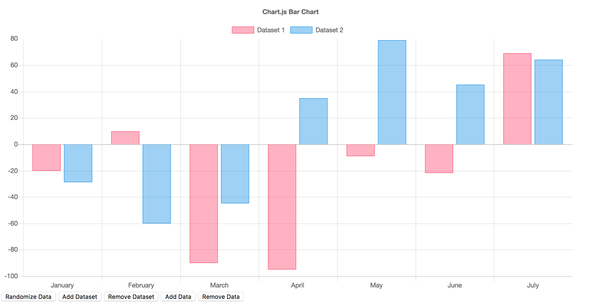

Independent Project Report

Darren Yang

#### Motivation

As the repid development of artificial intelligence, more and more people are trying to find their way to become a data scientist, an data analyst or just wanting to do something artificial intelligence algorithms related research.

What I'm going to do is to develop an easy to use product called [Eastcode](https://thuyangyu.github.io/GIX-MSTI-510-independent-project/index.html), which could help people to easily start coding artificial intelligent related algorithms with  intelligent and interactive user interface.

#### Problem

Eastcode solves problems for three group of people:

For the AI algorithm learner without strong computer-science background, Eastcode makes it easy  to start coding, and allow them only focus on algorithm itself.

For AI algorithm Engineer, Eastcode provides an easy way to do module training, it has an clear interface for them to execute parameter adjusting and view the visualization result.

For Methematician, they can test their new methematical model or new algorithms quickly with Eastcode.

#### Technical implementation

##### Key functions

1. Interactive Webpage.

   

2. Interactive Data Visualization Tools (Graphical).

   

3. Sensor Data Monitor, which could monitor sensor data through Tablet.

##### Running Processing(input/output)

Code starters can select language first, which supports C++ and Python. Then users input function name and function parameters, then the interface generates code from these parameters as showing above. After user input their whole algorithm and click "Test it", the interface could evaluate if there is error in user's code. Then user will correct them and start make the result visible by clicking the charts they want to use. The demo now provides line chart and bar chart, and it would provide more charts in the furture.

This interface could be used to start different kind of codes. There are example models in the example model panel. There are several piece of codes stored here and user could click them to view the code source code and code demo, and they can easily implement these senser data handler into their own code. It will save a lot of their time. Currently, this demo only support "Sensor Data Log", which is a piece of code handling accelaration sensor and compass sensor, it could also detect if the device is standing up or not.

##### All overall system diagram

##### technique implementation

For the user input part, I have used **Bootstrap** to make the interactive framework and wrote a intelligent start code generator.

For the code processing part, **Brython** is used which would help to interpret the python code user puts on it.

For the display output part, **Chartjs** is used to build the fancy display.

#### Evaluation 

##### Evaluation protocol

We allow several users including an AI algorithm learner and an AI algorithm engineer to test Eastcode Demo. Every user took a questionnaire before they start the test. Before they take the test, Eastcode was introduced to them with same introduction guide.

According to the evaluation with these people, they feel very comfortable to use Eastcode, it is exactly what they really need.

##### Findings of AI algorithm learner

Positive Feedback:

- Al algorithm learner found it interesting when interact with Eastcode, it provide a new way for them to start to learn coding.
- Al algorithm learner found it useful when they trying to define several parameter of a function regardless of whether they know details of the program language(python).

Problems:

- The code text editor is not so good to help users to debug.

Suggestions:

- It could be very useful if Eastcode could provide powerful debugging tools.

##### Findings of AI algorithm engineer

Positive Feedback:

- AI algorithm learner found it easier to implement their data display with Eastcode. It saves them a lot of time when then trying to write code display part of their certain algorithm.

Problem:

- There are some little bugs with the github depolyment, which leads to incoherence of data processing.

Suggestions:

- It could be better if they could download the code in modules panel.

#### Reflection

##### ​Problem

It takes a lot of time for me to find a valuable problem. What eastcode wants to solve is right what AI algorithms learner wants to learn and what AI algorithm engineer wants to use.

##### Implementation

It takes some time when finding the right framework to implement the technical part of Eastcode. I'm trying to use pypy.js fisrt to interpret the python code generated, but it turns out to be unavailable, then I changed to **Brython**, which could interpret python code inside a web page.

##### Evaluation

Generally, the evaluation gives me a lot chances to communicate with real poeple about Eastcode, many potential requirements were proposed. However, it could be better if we find more user cases to do evaluation.

##### Teamwrok

There is only one person on my team, I think it was more efficient than several people in one team.

##### Time management

I think the time management of product Eastcode could be done better next time, it tooks a bit more time in the problem defining part. But it would be good if we could find a real need of most of people.

#### Mile stone

The first three phases of the milestone were finished on time, while the real problem is still going on at Week three, before I finally found something valuable to do, the Eastcode. Then the independent project direction was slightly changed, while all the sensor data processing code was used in the new project.​

#### Demo video

Eastcode demo video could be found here.

