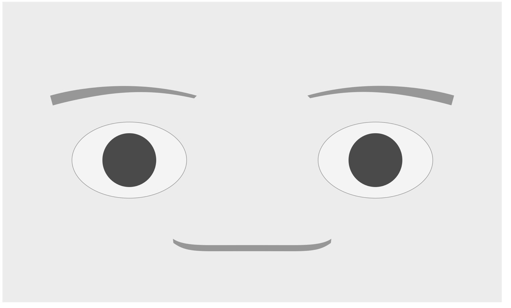

## Report for social robot face

##### Title

Buddy: A social robot for stress assessment in teens

##### Name

Darren Yang

#### Introduction

##### Problem

People always feel stressed after work, especially those singles. They usually find it hard to have a family member to share their daily bad emotion and make them released. They need a social robot to provide them human-like emotional care.

##### Solution

We can define the social robot as an intelligent robot which can process human voice and act as a voice assistant. It also can see the human face and estimate human emotion through image it gets and voice it hears. Then it gives out some suggestinos about how to relax and then it plays appropriate music, tells a story, dances or show interactive emojis on its screen based on human emotion.

For social robot version 1, it can respond to user's mouse and collect user's energy level and emotion level. These fancy functions above will be achieved in following version.

#### Robot Design

The interface shows the face of the robot and the emotional input bar is also on this screen. They can be separated easily if needed.

##### Design element

Normal face is the default interface.

When your stress level is less stress or your energy level is energetic, it will show the happy face with eyebrow up.

When your stress level is more stress or your energy level is less energy, it will show the sad face with inverse eyebrow.

With suggestions or blessings, it shows like this.

#### Robot Functionalities

1. Click the face, it says Hi. Wait for some time and it shows its origin.
2. The eyeball will move with mouse position.
3. Select your stress level, click submit, then it will show suggestions(if you are in low stress mode) or show blessing(if you are in high stress mode)
4. Select your energy level, click submit, then it will show suggestions(if you are in low energy mode) or show blessing(if you are in high energy mode)

#### UX Flow

#### Implementation link

[http://104.207.159.51:3000/social-robot/index.html](http://104.207.159.51:3000/social-robot/index.html)

#### Source Code

[https://github.com/thuyangyu/thuyangyu.github.io/tree/master/social-robot](https://github.com/thuyangyu/thuyangyu.github.io/tree/master/social-robot)

