# Woodpecker

#### Team member

Ivan Yin(Pecker), Darren Yang(Wood)

#### Tag Line

When a pecker meets its wood.

#### Description

In this quarter’s fabarbacation class, We, Darren and Ivan are created a wood and a pecker. The wood and the pecker can perform a function by its own, and when they are connected together, they both will perform something special.

The pecker (bird) consists of a body, a button, an RGB LED strip, and an adafruit trinket . If the pecker is detached (Standalone) from the tree (wood), there is a button on the woodpecker’s back, once pressed, the LED inside of the body will glow- change to yellow color. The pecker’s feet can be mount to the wood via communication wires, once mounted, the LEDs inside of the body will become colorful with color changing. The pecker body is made with acrylic.

The tree part consists of tree body, platform base, battery box, RGB LED lights, buttons to switch. Three buttons are designed to change the LED color of the tree. Users can use button choose different seasons for the tree, the tree will show green, yellow and white in summer, autumn and winter season. And there is a mounting point on the tree for the woodpecker. Once mounted, the tree started to display a constantly changing color together with the bird. The tree would be cut with transparent acrylic to make the tree illuminated.


#### System Diagram


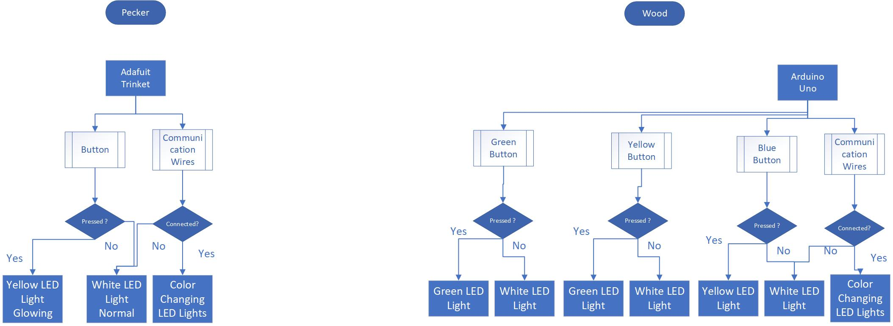


#### Implementation

##### Pecker

The bird is using neopixel light, in normal condition, the led is white color, if a button is pressed, the bird is turning yellow. There is also three communication wire located at the feet of pecker, once the pecker is connected to the wood, the LEDs inside of the bird is become colorful.

##### Wood-The Tree

The core board of the tree part is Arduino Uno, there are three functionality part of the tree: LED support model, communication model and button control model.

LED control model could control the LED to show 3 different status: default status is white, connected status is color rainbow, button pressed status is chasing color.

Communication model could receive the signal from the bird, the bird and the wood are share ground signal and if the  input signal is LOW, the tree will show status connected; in the same time, the wood will always set the output to LOW, this is the signal output to the birld.

Button control model could control the system reaction of the button press. If green button is pressed, the LED will show green chase, the same as the yellow button and blue button.


#### Schematics Layouts

##### logic-diagram-from-roposal

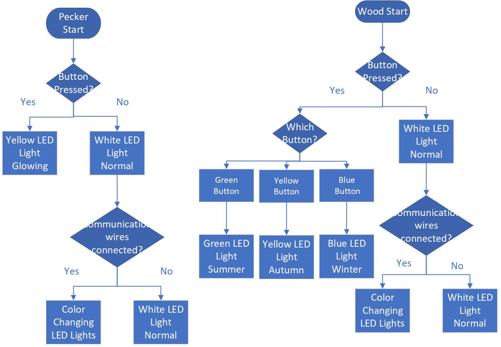


##### bird-schematics

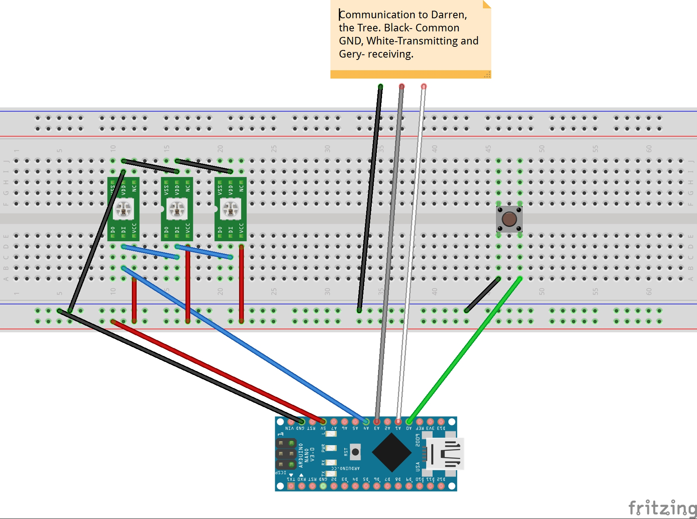


##### wood-schematics


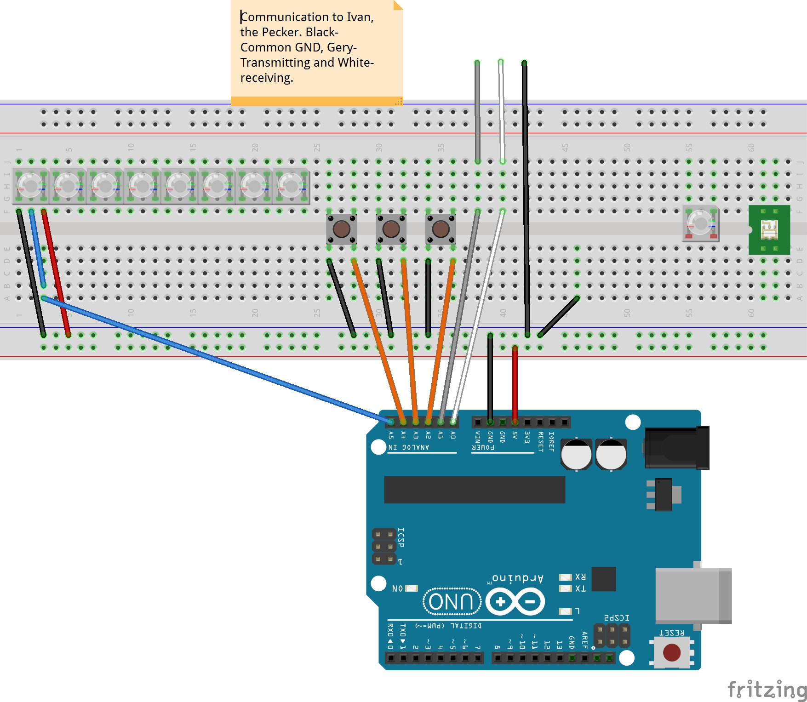

#### Software

The bird is using neopixel light, there is a for loop, and inside the for loop, there is a two if-else, if the button is pressed, which is a low signal, the led light will change to yellow. The communication wires are send in a low signal to darren’s wood. Darren is also sending a low signal to my pecker, is a low signal is received, which means connected, the leds inside of the bird will become colorful with changing color. 


##### code for pecker

```c
//Attribution List
//macro define, setup(), loop() are written by Ivan.
//Adafruit driver h file, colorSet(), chase() functions are referenced from the NeoPixel framework example code.

#include <Adafruit_NeoPixel.h>

//define pin number
#define PIN      2
#define N_LEDS   5
#define Button_Input 0
const int xmitPin = 1;
const int recvPin = 3;


Adafruit_NeoPixel strip = Adafruit_NeoPixel(N_LEDS, PIN, NEO_GRB + NEO_KHZ800);

void setup() {


  strip.begin();
  strip.show();
  //define pin mode
  pinMode(recvPin, INPUT_PULLUP);
  pinMode(Button_Input, INPUT_PULLUP);
  pinMode(xmitPin, OUTPUT);
  //itPin = HIGH;
}

void loop() {
  //if communication wires are connected
  digitalWrite(xmitPin, LOW);// send a low voltage signal
  //define variable
  int recvVal = digitalRead(recvPin);
  int buttonInputVal = digitalRead(Button_Input);
  if (recvVal == LOW) {


    chase(strip.Color(255, 0, 0)); // Red
    chase(strip.Color(0, 255, 0)); // Green
    chase(strip.Color(0, 0, 255)); // Blue

  }
  else {
    //if communication wires are not connected
    //if button is not pressed
    if (buttonInputVal == LOW) {
      colorSet(strip.Color(255, 0, 0, 255)); // White
    }
    else {
      //if button is pressed
      chase(strip.Color(255, 255, 0, 255)); // Yellow
    }
  }
}

//sample neopixels code
static void chase(uint32_t c) {
  for (uint16_t i = 0; i < strip.numPixels() + 4; i++) {
    strip.setPixelColor(i  , c); // Draw new pixel
    strip.setPixelColor(i - 4, 0); // Erase pixel a few steps back
    strip.show();
    delay(25);
  }
}

void colorSet(uint32_t c) {
  for (uint16_t i = 0; i < strip.numPixels(); i++) {
    strip.setPixelColor(i, c);
  }
  // update once
  strip.show();

}

```

##### code for wood

```c
//Attribution List
//macro define, setup(), loop() are written by Darren.
//Adafruit driver h file, colorWipe(), rainbow(), theaterChase(), Wheel() functions are referenced from the NeoPixel framework example code.


#include <Adafruit_NeoPixel.h>
#ifdef __AVR__
#include <avr/power.h>
#endif

#define LED_SIGNAL_PIN 8

#define COMMUNICATION_OUTPUT 7
#define COMMUNICATION_INPUT 4
#define BUTTON_GREEN_INPUT 13
#define BUTTON_YELLOW_INPUT 12
#define BUTTON_BLUE_INPUT 11

// Parameter 1 = number of pixels in strip
// Parameter 2 = Arduino pin number (most are valid)
// Parameter 3 = pixel type flags, add together as needed:
//   NEO_KHZ800  800 KHz bitstream (most NeoPixel products w/WS2812 LEDs)
//   NEO_KHZ400  400 KHz (classic 'v1' (not v2) FLORA pixels, WS2811 drivers)
//   NEO_GRB     Pixels are wired for GRB bitstream (most NeoPixel products)
//   NEO_RGB     Pixels are wired for RGB bitstream (v1 FLORA pixels, not v2)
//   NEO_RGBW    Pixels are wired for RGBW bitstream (NeoPixel RGBW products)
Adafruit_NeoPixel strip = Adafruit_NeoPixel(18, LED_SIGNAL_PIN, NEO_GRB + NEO_KHZ800);

void setup() {
  pinMode(COMMUNICATION_OUTPUT, OUTPUT);
  pinMode(COMMUNICATION_INPUT, INPUT_PULLUP);
  pinMode(BUTTON_GREEN_INPUT, INPUT_PULLUP);
  pinMode(BUTTON_YELLOW_INPUT, INPUT_PULLUP);
  pinMode(BUTTON_BLUE_INPUT, INPUT_PULLUP);
  strip.begin();
  strip.show(); // Initialize all pixels to 'off'
}

void loop() {
  
  //give a signal low to bird when connected.
  digitalWrite(COMMUNICATION_OUTPUT, LOW);
  //receive signal from the bird, if == LOW, show rainbow color.
  int communicationInputVal = digitalRead(COMMUNICATION_INPUT);

  //get input signal from 3 button
  int buttonGreenInputVal = digitalRead(BUTTON_GREEN_INPUT);
  int buttonYellowInputVal = digitalRead(BUTTON_YELLOW_INPUT);
  int buttonBlueInputVal = digitalRead(BUTTON_BLUE_INPUT);

  if (communicationInputVal == LOW) {
    //show rainbow if connected.
    rainbow(18);
  }
  else {
    if (buttonGreenInputVal == LOW)
      theaterChase(strip.Color(0, 255, 0), 50); // Hold button Green, show green chase
    else if (buttonYellowInputVal == LOW)
      theaterChase(strip.Color(255, 255, 0), 50); // Hold button Yellow, show yellow chase
    else if (buttonBlueInputVal == LOW)
      theaterChase(strip.Color(0, 0, 255), 50); // Hold button Blue, show blue chase
    else colorWipe(strip.Color(255, 255, 255, 0), 50); // Show default White Static;
  }
}


// Fill the dots one after the other with a color
void colorWipe(uint32_t c, uint8_t wait) {
  for (uint16_t i = 0; i < strip.numPixels(); i++) {
    strip.setPixelColor(i, c);
    strip.show();
    delay(wait);
  }
}


void rainbow(uint8_t wait) {
  uint16_t i, j;

  for (j = 0; j < 256; j++) {
    for (i = 0; i < strip.numPixels(); i++) {
      strip.setPixelColor(i, Wheel((i + j) & 255));
    }
    strip.show();
    delay(wait);
  }
}


//Theatre-style crawling lights.
void theaterChase(uint32_t c, uint8_t wait) {
  for (int j = 0; j < 10; j++) { //do 10 cycles of chasing
    for (int q = 0; q < 3; q++) {
      for (uint16_t i = 0; i < strip.numPixels(); i = i + 3) {
        strip.setPixelColor(i + q, c);  //turn every third pixel on
      }
      strip.show();

      delay(wait);

      for (uint16_t i = 0; i < strip.numPixels(); i = i + 3) {
        strip.setPixelColor(i + q, 0);      //turn every third pixel off
      }
    }
  }
}

// Input a value 0 to 255 to get a color value.
// The colours are a transition r - g - b - back to r.
uint32_t Wheel(byte WheelPos) {
  WheelPos = 255 - WheelPos;
  if (WheelPos < 85) {
    return strip.Color(255 - WheelPos * 3, 0, WheelPos * 3);
  }
  if (WheelPos < 170) {
    WheelPos -= 85;
    return strip.Color(0, WheelPos * 3, 255 - WheelPos * 3);
  }
  WheelPos -= 170;
  return strip.Color(WheelPos * 3, 255 - WheelPos * 3, 0);
}
```


#### Gallery


##### Pecker


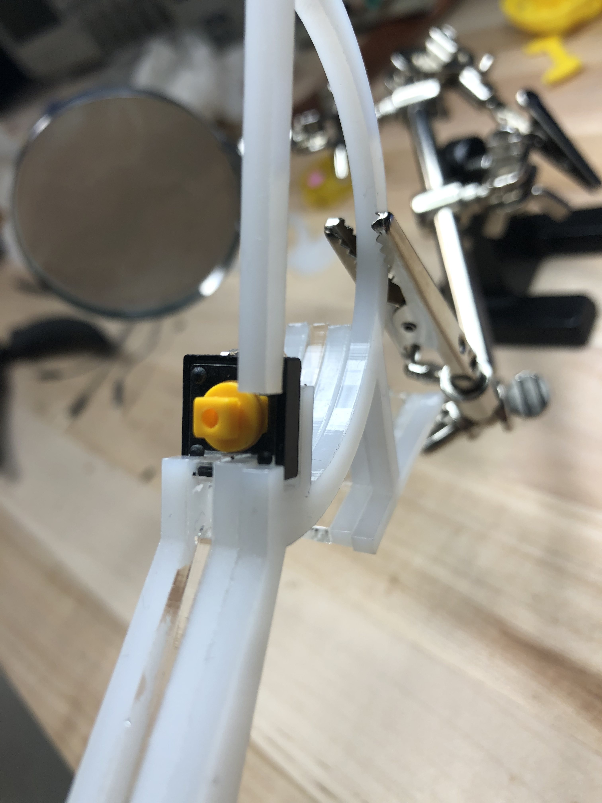


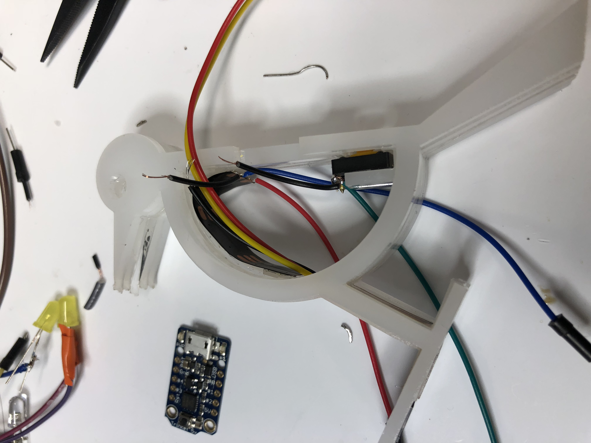


##### wood


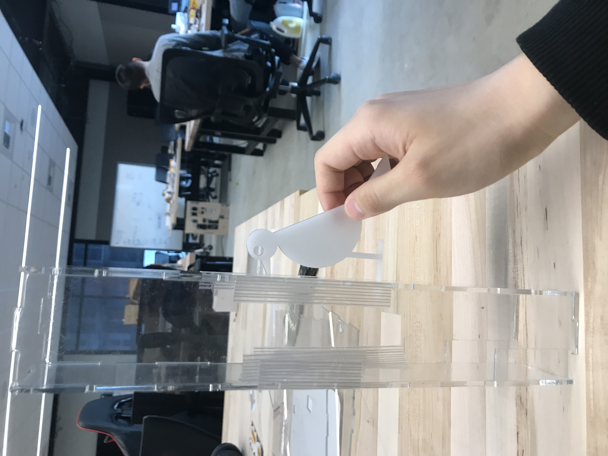

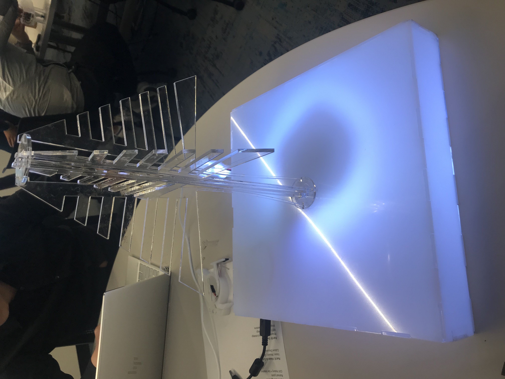

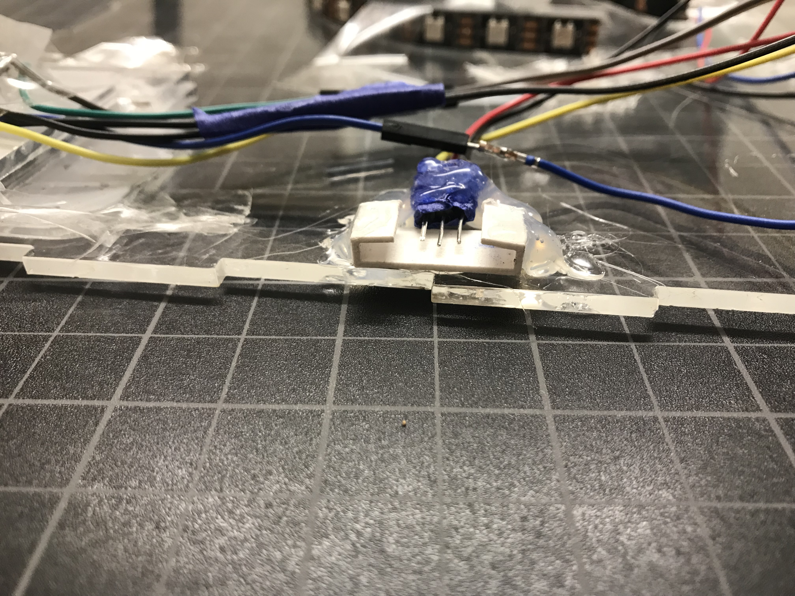

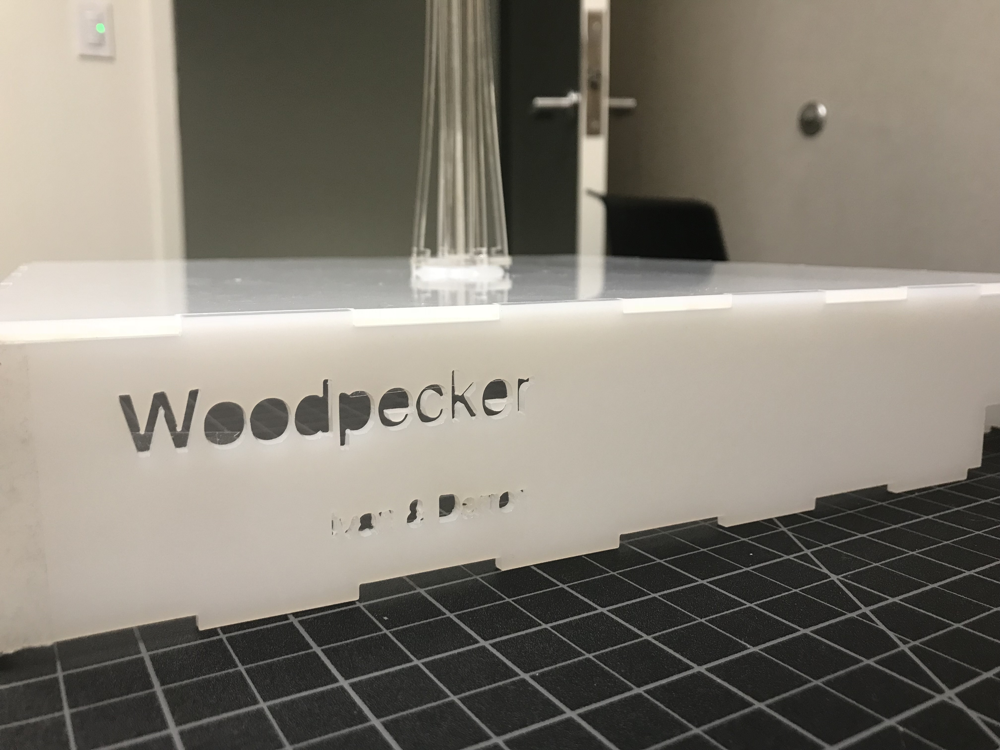

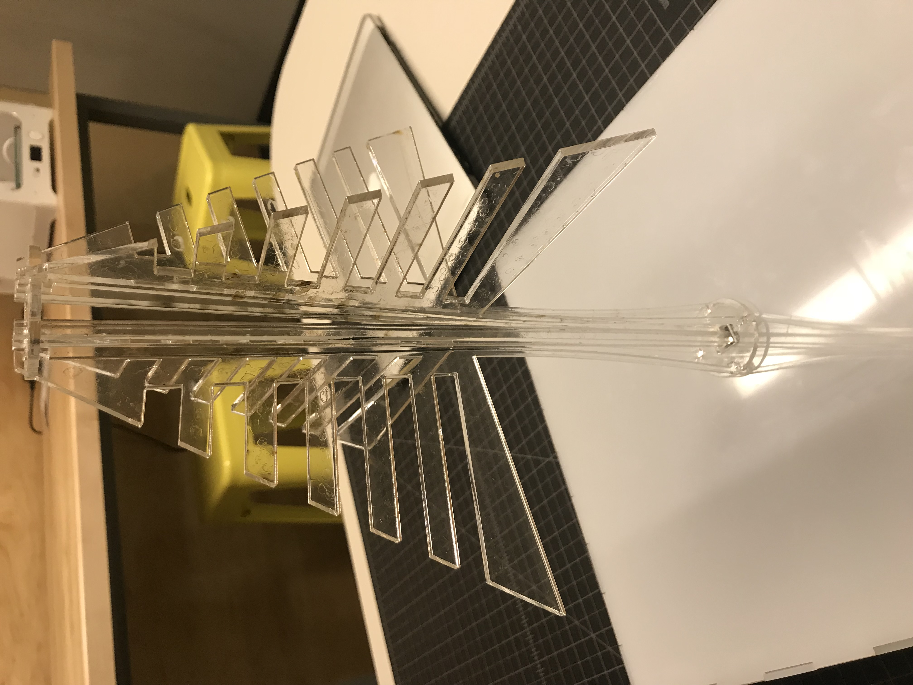

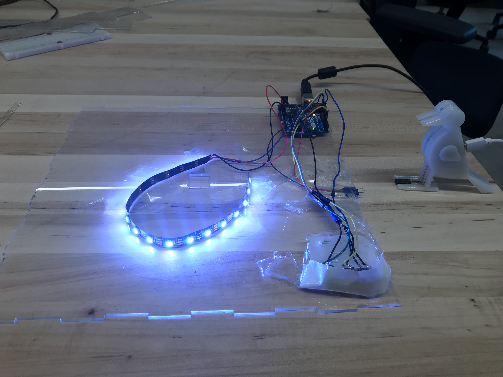


#### Process

##### Pecker

The pecker is the smallest project among all projects, it is always harder to engineer things that was small, it takes me a lot of time to design the wire layout inside of the pecker. And the trinket is not as reliable as arduino uno.  

##### Wood

The tree head is made of transparent acrylic. The innovative part of the tree design is the bend tree truck, which were line cut and bent automatically when assemble. 

The top face and the faces all around of the tree base is made of non-transparent acrylic to scatter the LED light to get  more comfortable viewing experience.