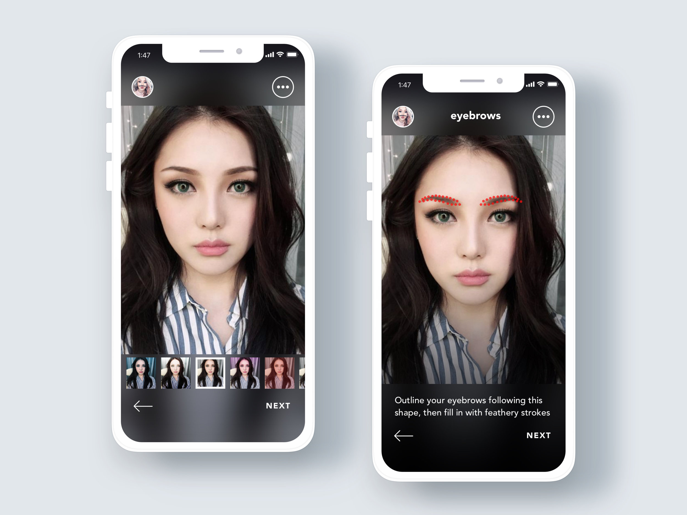

<!-- Main -->

<!-- One -->
<!--
<section id="one">
	

		<header class="major">
			<h2>Sed amet aliquam</h2>
		</header>
		
Nullam et orci eu lorem consequat tincidunt vivamus et sagittis magna sed nunc rhoncus condimentum sem. In efficitur ligula tate urna. Maecenas massa vel lacinia pellentesque lorem ipsum dolor. Nullam et orci eu lorem consequat tincidunt. Vivamus et sagittis libero. Nullam et orci eu lorem consequat tincidunt vivamus et sagittis magna sed nunc rhoncus condimentum sem. In efficitur ligula tate urna.

	

</section>
-->

<!-- Two -->
<section id="two" class="spotlights">
	<section>
		
		

			

				<header class="major">
					<h3>Building Towards "Invisible Cloak"</h3>
					<b>Research upon Robust Physical Adversarial Attack on YOLO Object Detector</b>
				</header>
                
Deep learning based object detection algorithms like R-CNN, SSD, YOLO have been applied to many scenarios, including video surveillance, autonomous vehicle, intelligent robotics et al. With more and more application and autonomy left to deep learning based artificial intelligence, humans want to ensure that the machine does the best for them under their control. However, deep learning algorithms are known to be vulnerable to carefully crafted input known as adversarial examples which makes it possible for an attacker to fool an AI system. In this work, we explored the mechanism behind the YOLO adversarial examples to attack the YOLO model. The experiment shows that this white box attack method is effective and has a success rate of 100% in crafting digital adversarial examples to fool the YOLO model. We also proposed a robust physical adversarial sticker generation method based on an extended Expectation Over Transformation (EOT) method(a method to craft adversarial example in the physical world). We conduct experiments to find the most effective approach to generate adversarial stickers. We tested the stickers both digitally as a watermark and physically showing it on an electronic screen on the front surface of a person. Our result shows that the sticker attack as a watermark has a success rate of 90% and 45% on photos taken indoors and on random 318 pictures from ImageNet. Our physical attack also has a success rate of 72% on photos taken indoors. We shared our project <a href="https://github.com/thuyangyu/YOLO_attack">source code</a> on the Github and our work is reproducible.

				<ul class="actions">
					<li><a href="assets/files/PID5631405.pdf" class="button">See paper PDF</a></li>
				</ul>
			

		

	</section>
	<section>
		
		

			

				<header class="major">
					<h3>Intelligent Interactive Indoor Path Guide</h3>
				</header>
				
Aiming at designing an intelligent and interactive map that can navigate users indoors and provides users an easy way to label rooms & path information from both user-friendly interface and rich sensor information. We developed an frontend web interface to allow users searching paths, adding paths and annotate paths on the map. We built a manipulator controller on ASP.NET to integrate map digesting & intelligence model, database; deployed on Microsoft Azure. This system still serves in Microsoft Research Asia Building No.2 Floor 14th.

				<ul class="actions">
					<li><a href="assets/files/i3m_slides.pdf" class="button">See Slides</a></li>
				</ul>
			

		

	</section>
	<section>
		
		

			

				<header class="major">
					<h3>Miirabella</h3>
				</header>
				
Miirabella is a makeup assistant app that could give you instructions as you are putting on makeups. Using computer vision & machine learning technology, Miirabella is able to guide you through the makeup process step by step. When you open Miirabella app, preview all the recommended looks and select the desired one, then start the interactive makeup tutorial.

				<ul class="actions">
					<li><a href="ProjectsWebsite/Miirabella/index.htm" class="button">Learn more</a></li>
				</ul>
			

		

	</section>
</section>

<!-- Three -->
<!--
<section id="three">
	

		<header class="major">
			<h2>Massa libero</h2>
		</header>
		
Nullam et orci eu lorem consequat tincidunt vivamus et sagittis libero. Mauris aliquet magna magna sed nunc rhoncus pharetra. Pellentesque condimentum sem. In efficitur ligula tate urna. Maecenas laoreet massa vel lacinia pellentesque lorem ipsum dolor. Nullam et orci eu lorem consequat tincidunt. Vivamus et sagittis libero. Mauris aliquet magna magna sed nunc rhoncus amet pharetra et feugiat tempus.

		<ul class="actions">
			<li><a href="AboutTheBlog.html" class="button next">Get Started</a></li>
		</ul>
	

</section>
-->

