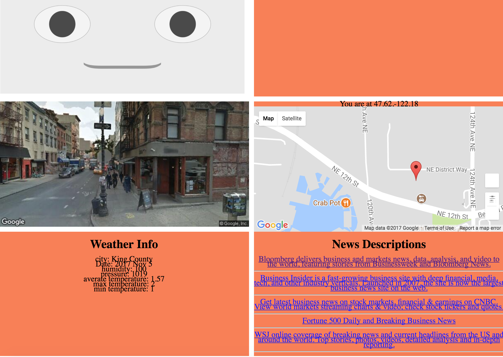

## Report for Social Robot V-2

##### Title

Buddy: A social robot for stress assessment in teens

##### Name

Darren(Yu) Yang

#### Introduction

##### Problem

People always feel stressed after work, especially those singles. They usually find it hard to have a family member to share their daily bad emotion and make them released. They need a social robot to provide them human-like emotional care.

##### Solution

We can define the social robot as an intelligent robot which can process human voice and act as a voice assistant. It also can see the human face and estimate human emotion through image it gets and voice it hears. Then it gives out some suggestinos about how to relax and then it plays appropriate music, tells a story, dances or show interactive emojis on its screen based on human emotion.

For social robot version 2, it can respond to user's touch, device movement, overturn and give out text or voice responses. It can also gather geolocation infomation

#### New Functionalities

##### Geolocation Sensor

The robot gather geolocation information from device geolocation sensor and then display four parts on its main page.

1. A google map window which shows the current location.
2. An image nearby.
3. Current local weather.
4. local news.

##### Orientation Sensor

The robot gather infomation from device orientation sensor and show 4 status on its main page. The status indicate whether the devices is stand-up, lie-down, face-up and face-down.

##### Motion Sensor

The motion sensor detects if the device is pushed on a table or lifted off the table. If this motion happens, it will give out a voice of "Auch, please be careful about me. Thanks!"

##### Touch Sensor

If the robot face is touched, It will give out a voice of "hello, how are you". 

#### Implementation link

> Notes: This social robot page is optimized by Iphone 7 Plus.
>

[http://104.207.159.51:3000/social-robot/index.html](http://104.207.159.51:3000/social-robot/index.html)

#### Source Code

[https://github.com/thuyangyu/thuyangyu.github.io/tree/master/social-robot](https://github.com/thuyangyu/thuyangyu.github.io/tree/master/social-robot)

